# CPD Yr Wyddgrug
CPD Yr Wyddgrug are a newly formed club within the small market town of _Mold_ (Yr Wyddgrug in Welsh) located in North Wales. This site hopes to help keep the fan base of the club up to date with upcoming fixtures, recent results as well as the current league standing. 
As it is a newly formed club, this site also hopes to help broaden the landscapes of the clubs following and reach people outside the town of _Mold_. This site will provide updates on recent news events conducted by the club and also offer people the chance to buy club merchandise.
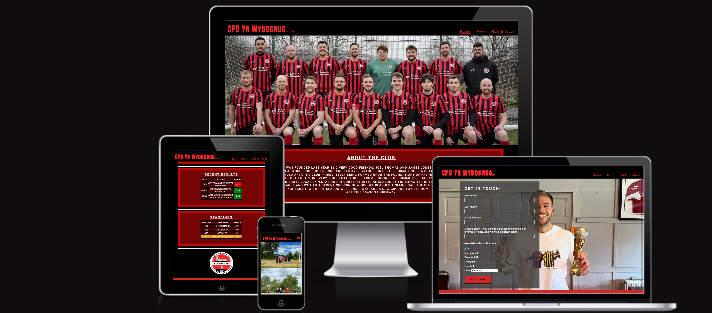

## Features
- **Navigation Bar**
    - The navigation bar is featured on all 3 pages of the site. It is styled with the home colours of the club. The navigation bar is fixed to the top of the page and is fully responsive. It includes links to the _Logo_, _Home_, _News_ and _Get in touch_ page. It is identical in each page to allow for easy navigation between pages.
    - This section of the site will allow any user to navigate between all 3 pages with ease on any device. The design will mean the user can navigate without the use of the 'back' button, which will hopefully improve UX.
    
    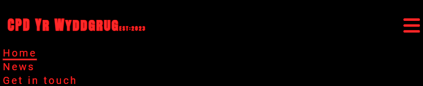

- **The landing page image**
    - The landing page is a team photo in the clubs home colours to make it very clear to the user exactly whos website they are on.
    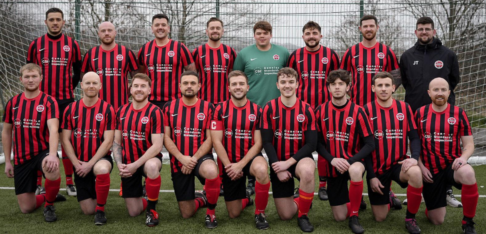

- **About the club section**
    - As this is a newly formed club (only 1 year old) this section is designed to give the user a brief introduction to the club and provide information on how this all started. 
    - Additionally, this section provides the user with a quick overview of how the club got on within their first year of existence. 
    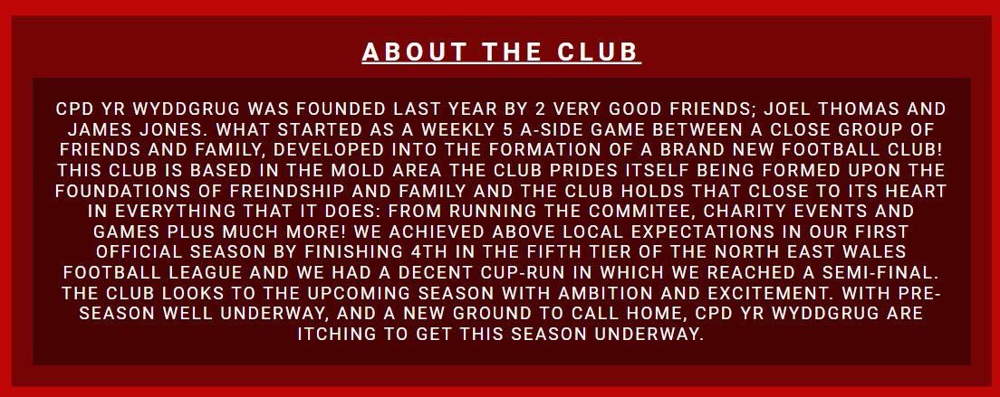

- **Fixtures section**
    - This part of the site is to show the user the next 3 fixtures (by using the opposition badge) for CPD Yr Wyddgrug. 
    - It informs the user of the date of the fixture and whether the game will be played at home or away.
    - This section will be updated to keep the user informed of the upcoming fixtures.
    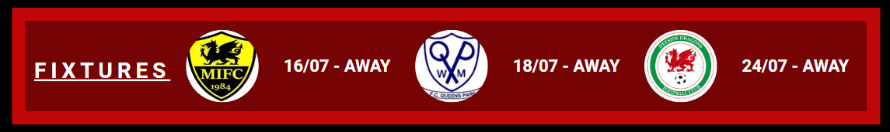 
    
- **Recent Results section**
    - This section allows the user to very easily see the last 3 results for CPD Yr Wyddgrug.
    - It shows the date the game took place and the score. With the use of red highlight (for a defeat) and green highlight (for victory) it demonstrates clearly how well CPD Yr Wyddgrug got on in that game.
    - This section will also be updated as more recent results come in.
    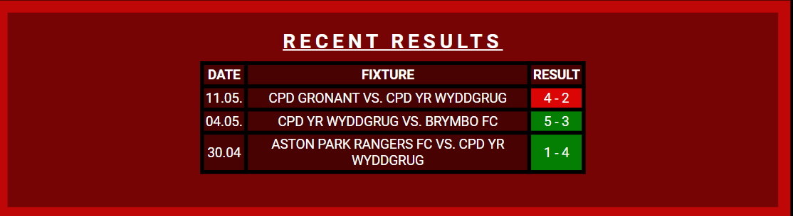

- **Standings section**
    - This section allows the user to see how CPD Yr Wyddgrug are performing in comparison with the rest of the league.
    - It demonstrates their league position (highlighted in yellow) and the amount of points accumulted throughout the season so far as well as the teams above them in the league.
    - This section will be updated as the new season starts. 
    - This section will be updated to provide the user with more information which can be used to better compare the progress of CPD Yr Wyddgrug with its rvials throughout the season. Information to be included will be;
        - More teams on the table
        - Number of games played
        - Number of Wins, Draws and Losses
        - Number of goals Scored or Conceded
    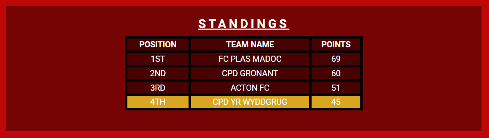
    
- **Bottom of page and footer**
    - The bottom of the page shows the badge of CPD Yr Wyddgrug.
    - The footer section includes links to the clubs social media sites. The links open in a new tab to allow for easy navigation to the user. 
    - The footer is valuable as it encourages the user to visit the clubs social media platforms. This is built with the sites original intention to help improve the following of the club.
    

- **News** 
    - The news section is built to allow the user to see what the club has been doing lately. 
    - It also allows the user to see examples of merchandise that are available to buy.
    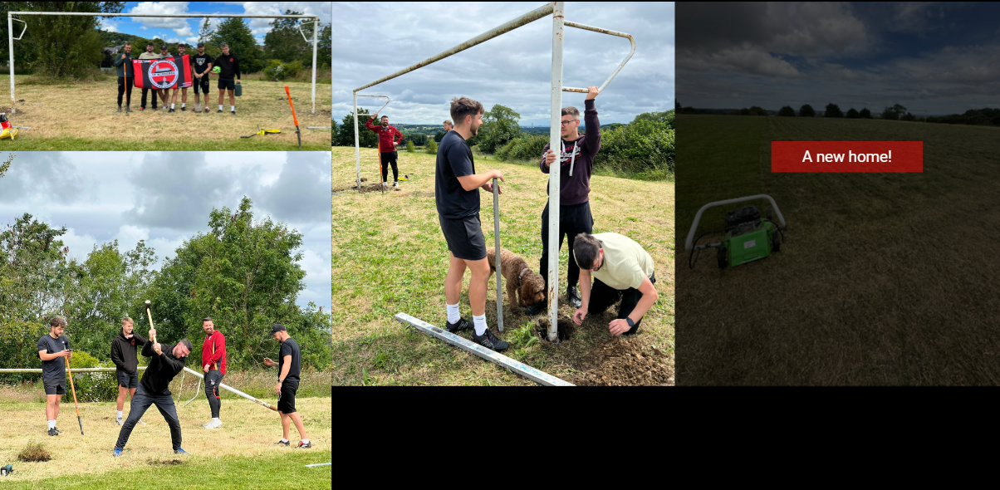
    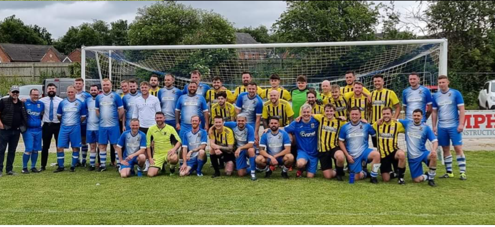
    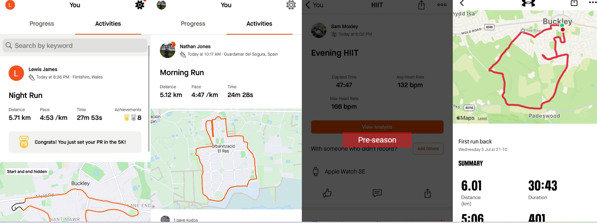
    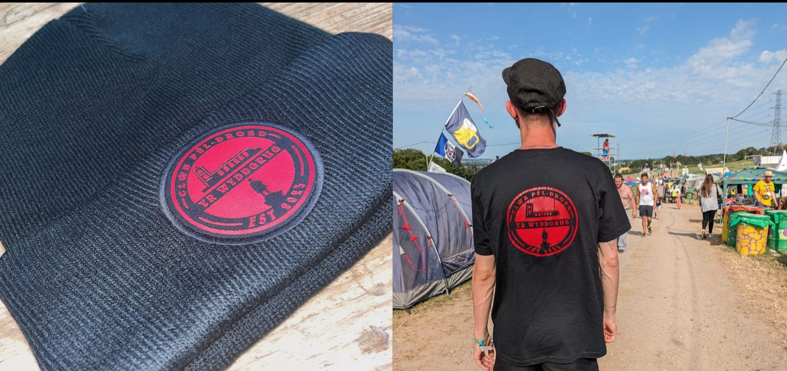

- **Get In Touch**
    - This section will allow the user to get in touch with the club. The form will take basic information off the user and encourage the user to leave a message.
    - The message from the user should either be to enquire about merchandise or a to arrange a friendly game. However, it is not just restricted to this and the user could leave any message they wish. The club can then respond to the message by getting in touch with the user directly. 
    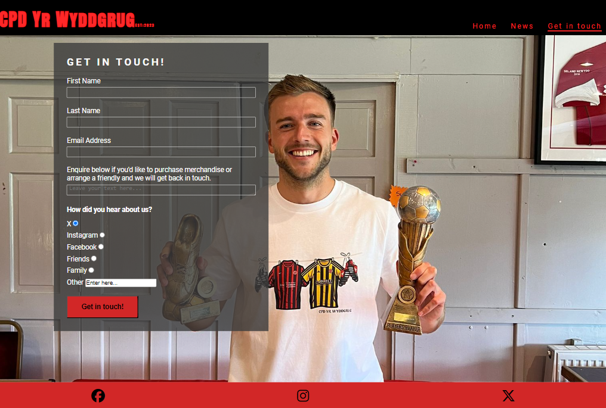

- **Features left to implement**
    - A page which allow users to make contributions to Cancer Reasearch UK. This is a charity close the club and one that the club as raised over £1000 for recently. It would like to offer the opportunity for donations from users.
    - A highlights section for the website, which would allow user to watch clips from recent games. Including goals, saves, phases of play and post-match interviews.

*The code institues **Love Running** project helped provide; the main part of the structure for the website, the footer, navigation bar, formatting of the pictures within the "News" page and the form on the "Get In Touch! page.*

## Testing
The website has been sufficiently tested. The websites links within the navigation bar and footer have been tested and work. The website has shown to be responsive on different devices and the form on the "Get In Touch!" page works (will not submit unless all fields correctly filled). 
- The above has been tested on the following:
    - Chrome and Edge on PC
    - Safari on Mobile and tablet

- The website looks good on the different devices and browsers with the responsiveness styling working as intended.
- Getting the rival club badges to **not** overfill it's element section when using smaller devices was difficult. However, with the use of the *code institute* programme I was able to apply the correct styling so that it fits nicely in a column.
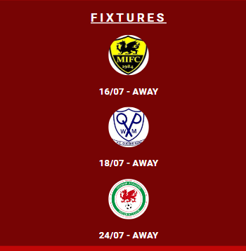

- Getting the hover element to show different text depending on the photo that was clicked proved to be difficult, however, with the implementation of several different *div* elements, the help of the *code institute* programme and *W3Schools* this was able to be achieved. 

- On the landing page, there was originally a textbox inlcuding information "Home: Gwernymyndd Village Hall". However, it was a struggle to come to a distinct conclusion on colouring that didn't contrast or look out of place so it was decided best, to be removed fully. This could be revisited and reapplied under a new update.

#### Validator Testing
- HTML
    - No errors were returned when passing each page through the official W3C validatior (https://validator.w3.org/).

- CSS
    - No errors were discovered when passing through the official CSS validator (https://jigsaw.w3.org/css-validator/).

#### Unfixed bugs
- Additionally, on screen sizes 993 - 1150px the hover comments on the "Pre-season" section of images are squashed and become unreadable. On larger devices it can be read as intended. 
    - This bug has been left for the mean time as the main purpose of this section was for use of largest devices, and it works, I can't appear to implement an effective change which corrects the bug without having an unfortunate knock on effect on the design on it's intended device size.
- On the "News" section, black spacing appears between the images (576px and more) and this does suit the overall 'feel' of the website. It would be nice if this empty space could be filled with information headings or the club logo, depending on screen-size. Will be looked to be implemented in future update. 
    - This bug has come about becuase of the need to segrogate the different sections for the images for the hover text to work. It has been decided that the hover functionality for larger devices is important in order for the viewer to know what *"news"* is being shown in the imagery. The black spacing is an unfortunate but accepted bug, and a new-way to showcase the imagery can be looked at in future to address this issue. 

## Deployment 
- The site was deplyed to GitHub pages. It has been deployed using the following steps:
    - In the GitHub repository (named = *CPD*) scroll down until you come across deplyments on the right hand side.
    - Click the github-pages link. 
    - Click the link within the github-pages box.
    - This will open a separate tab with the successfully deployed site. 

The live link can be found here; https://jlg-96.github.io/CPD/

## Credits
- Within the website, the code institue helped provide the coding for:
    - The navigation bar 
    - The footer
    - The form
    - How to make the photos in the "News" section responsive

- W3Schools have helped throughout the project by providing information on elements and how to format sections. Most importantly provided the code to help with the hover aspect on the images on the "News" page to reveal text. 
    - *The specific page that helped can be found here; https://www.w3schools.com/howto/tryit.asp?filename=tryhow_css_image_overlay_opacity .*

- Icons used within the site have been taken from https://fontawesome.com/

- The information for the fixtures and results section has been taken from my personal **Spond** account (https://www.spond.com/). 

- The badges used on the homepage were taken from google images.